  

  
  
  

  
  
  

---

  <b>The AI areas I care about most are the ones where models, infrastructure, and real-world systems meet.</b>

  This page maps the technical domains behind my projects and labs: machine learning infrastructure, reinforcement learning, robotics, distributed systems, model operations, and interactive education.

    

## Core Domains

  

## Labs

| Lab | Purpose |
| --- | --- |
| [Neural Lab](https://hirademami.github.io/neural-lab) | Interactive neural visualization and model intuition. |
| [Molecule Lab](https://hirademami.github.io/molecule-lab/index.html) | Hands-on molecule building from atoms, bonds, and structures. |
| [Model Forge](https://hirademami.github.io/model-forge/index.html) | A guided environment for learning machine learning foundations. |

## Engineering Principles

  

