<p align="center">
  
</p>


<p align="center">
  <a href="../README.md">
    
  </a>
  <a href="./PROJECTS.md">
    
  </a>
  <a href="./AI_DOMAIN.md">
    
  </a>
</p>

<p align="center">
  <a href="https://hirademami.github.io/">
    
  </a>
  <a href="https://hirademami.github.io/pages/blog.html">
    
  </a>
  <a href="./COLLAB.md">
    
  </a>
</p>


---

<p align="center">
  <b>Collaboration is most interesting to me when the work has a real system behind it: clear constraints, hard technical questions, and enough ambition to be worth engineering properly.</b>
</p>

<p align="center">
  I am especially interested in AI infrastructure, MLOps, research automation, reinforcement learning, robotics, interactive technical education, and tools that make complex systems easier to understand.
</p>

<p align="center">
  
</p>

---

## Collaboration Protocol

I like collaborations where the idea can survive contact with implementation. That usually means the project has a concrete problem, a visible technical path, and enough discipline to turn exploration into something usable.

| Signal | What it means |
| --- | --- |
| `BUILD` | There is a real artifact to design, implement, test, or improve. |
| `RESEARCH` | There is a question worth investigating, not just a vague topic. |
| `SYSTEMS` | The work involves architecture, reliability, scale, reproducibility, or tooling. |
| `LEARNING` | The output helps people understand a difficult technical concept more clearly. |
| `OPEN SOURCE` | The project benefits from public documentation, clean interfaces, and maintainable structure. |

## High-Value Collaboration Zones

### ML Infrastructure & MLOps

Model serving, training workflows, evaluation pipelines, experiment tracking, observability, deployment automation, and platform design. I care about the machinery that makes ML usable beyond notebooks.

### Research Tooling

Systems that make research workflows less fragile: PaperOps, reproducibility, benchmark automation, literature pipelines, experiment metadata, and clean handoff from idea to implementation.

### Reinforcement Learning & Agents

Multi-agent coordination, simulation environments, decision systems, evaluation loops, and agent behavior. I am more interested in measurable behavior than abstract agent hype.

### Robotics & Autonomous Systems

Perception, planning, control loops, embodied AI, and systems that need to operate under real constraints. Good robotics work forces clarity because the world does not accept vague abstractions.

### Interactive Technical Labs

Tools like Neural Lab, Molecule Lab, and Model Forge: visual systems that make complex ideas easier to explore directly. The goal is not decoration; the goal is intuition through interaction.

### Technical Communication & Developer Experience

README systems, diagrams, documentation structure, onboarding flows, and visual interfaces for technical projects. Good engineering is easier to trust when it is easier to inspect.

## What Makes A Strong First Message

The best collaboration message is short, specific, and grounded.

```text
Subject: Collaboration idea: <short project name>

I am building / exploring:
<one or two sentences>

The technical problem is:
<what is hard, unclear, or worth solving>

What exists now:
<repo, demo, paper, sketch, notes, or current status>

Where I think you might fit:
<architecture, ML infra, MLOps, RL, documentation, visual systems, review, etc.>

First useful milestone:
<something small enough to actually start>
```

If the first milestone is clear, the conversation can become technical quickly. That is usually a good sign.

## Good Fit / Poor Fit

<p align="center">
  
</p>

## Operating Style

<p align="center">
  
</p>

## Contact Vector

If the work connects to AI systems, ML infrastructure, research tooling, RL, robotics, or interactive learning labs, send the idea through one of the channels listed in the main [README](../README.md#-contact).

Useful links:

- [Projects](./PROJECTS.md)
- [AI Domains](./AI_DOMAIN.md)
- [Main Website](https://hirademami.github.io/)
- [GitHub Profile](../README.md)

---

**I'm a Night 🦉** 

```text
🌞 Morning                84 commits          ██░░░░░░░░░░░░░░░░░░░░░░░   07.17 % 
🌆 Daytime                215 commits         █████░░░░░░░░░░░░░░░░░░░░   18.34 % 
🌃 Evening                665 commits         ██████████████░░░░░░░░░░░   56.74 % 
🌙 Night                  208 commits         ████░░░░░░░░░░░░░░░░░░░░░   17.75 % 
```
📅 **I'm Most Productive on Saturday** 

```text
Monday                   187 commits         ████░░░░░░░░░░░░░░░░░░░░░   15.96 % 
Tuesday                  172 commits         ████░░░░░░░░░░░░░░░░░░░░░   14.68 % 
Wednesday                198 commits         ████░░░░░░░░░░░░░░░░░░░░░   16.89 % 
Thursday                 153 commits         ███░░░░░░░░░░░░░░░░░░░░░░   13.05 % 
Friday                   93 commits          ██░░░░░░░░░░░░░░░░░░░░░░░   07.94 % 
Saturday                 233 commits         █████░░░░░░░░░░░░░░░░░░░░   19.88 % 
Sunday                   136 commits         ███░░░░░░░░░░░░░░░░░░░░░░   11.60 % 
```

---

# 🐍 Contribution Journey
<p align="center">
  
</p>
