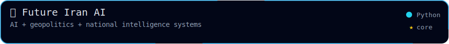
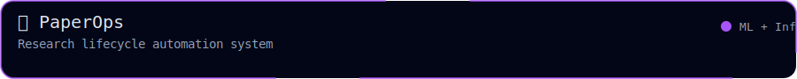
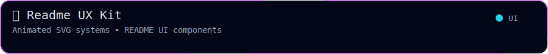
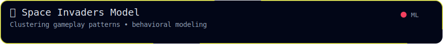

  

  
  
  

  
  
  

---

  <b>Selected work across AI systems, research tooling, machine learning infrastructure, and interactive technical experiments.</b>

  This page highlights projects that match the main direction of my GitHub profile: building practical systems around ML infrastructure, automation, reinforcement learning, data workflows, and developer-facing AI tools.

<h2 align="center">🧪 Project Highlights</h2>

<!-- Row 1 -->

  
  

<!-- Row 2 -->

  
  

<!-- Row 3 -->

  
  

## Project Index

| Project | Focus | Status | Why it matters |
| --- | --- | --- | --- |
| [Future Iran AI](https://github.com/HiradEmami/future-iran-ai-think-tank) | AI, geopolitics, intelligence systems | Research direction | Explores how AI systems can support strategic analysis and national-scale reasoning. |
| [PaperOps](https://github.com/PLAYERUNKNOWN-Productions/research-paperops) | Research automation, ML infrastructure | Collaboration / infrastructure | Turns research workflows into more reproducible, automated, and inspectable systems. |
| [Thirty-One Game](https://github.com/HiradEmami/ThirtyoneCard) | Game logic, epistemic reasoning | Project | Uses a card-game setting to explore multi-agent reasoning and decision logic. |
| [MARL](https://github.com/HiradEmami/MARL) | Multi-agent reinforcement learning | Experimentation | Focuses on coordination, learning dynamics, and agent behavior. |
| [README UX Kit](https://github.com/HiradEmami/readme-ux-kit) | SVG systems, README design | Toolkit | Provides visual components for expressive GitHub profiles and documentation. |
| [Space Invaders Model](https://github.com/HiradEmami/SpaceInvadersModel) | Behavioral modeling, clustering | ML project | Studies gameplay patterns through modeling and unsupervised learning ideas. |

## Current Direction

  

## What To Look At First

  

---

<h2 align="center">📊 Activity</h2>

  

  

  
    

